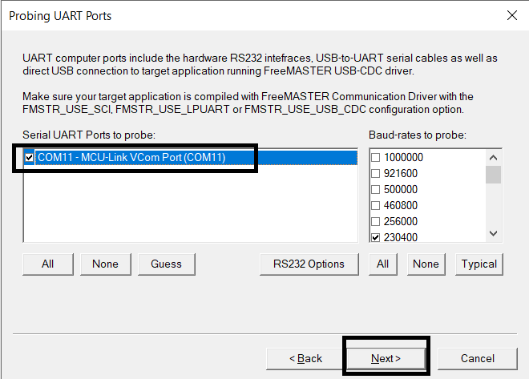
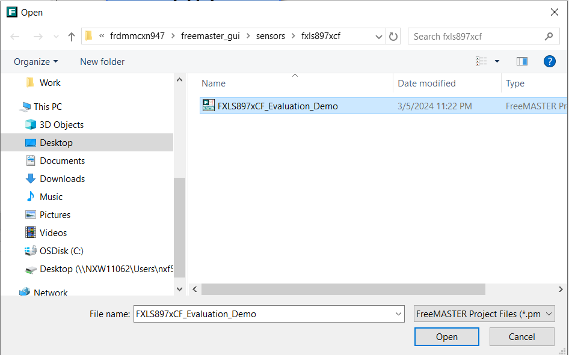
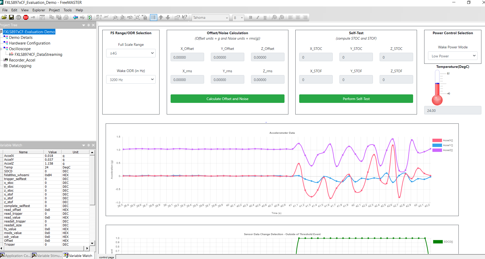
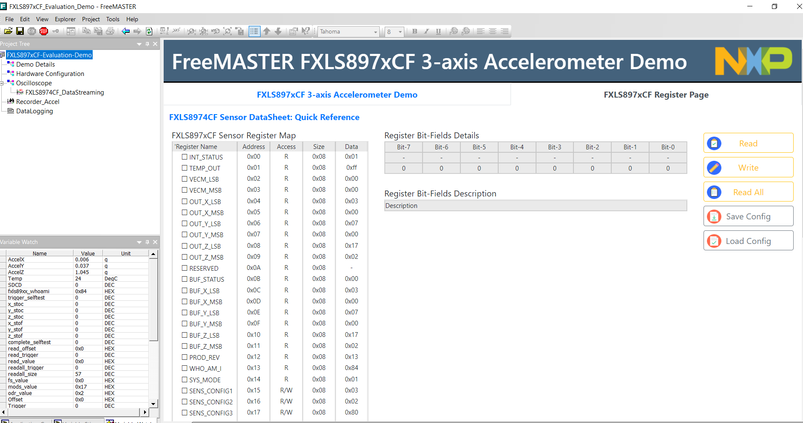
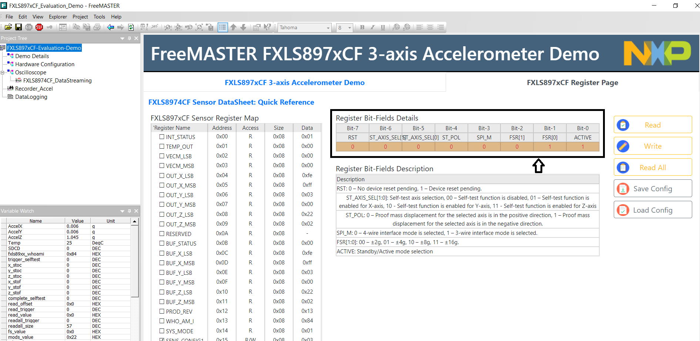

# NXP Application Code Hub

## FXLS89xxxF 3-axis accelerometer evaluation GUI using ISSDK and FreeMASTER

- This example demonstrates combining ISSDK and FreeMASTER to create FXLS89xxxF 3-axis accelerometer evaluation GUI for our customer to evaluate this sensor using sensor development tools with sensors expansion boards.

- NXP’s next-generation sensors feature a strong balance of intelligent integration, logic and customizable platform software to enable smarter, more differentiated applications.

- Easy enablement is of utmost importance to reduce evaluation, development & time to market. NXP’s Sensor development ecosystem is making it easier for customers to accelerate their sensor product development.

- The image below shows Sensors Development Ecosystem Offering:

    

- FXLS8974CF is 3-axis accelerometer targeted for application requiring low-power motion wake up. This sensor has SDCD embedded block which implements an efficient and flexible inertial event detection function to detect various inertial events like no-motion/motion, tap, freefall, transient events etc. This ultra-low power wake-up on motion can trigger host MCU to wake-up or go back to deep sleep mode when no motion detected autonomously.

- Target applications include a wide range of industrial and medical IOT applications that require ultra-low-power wake-up on motion:
Asset Tracking/ Inventory Management, Smart Meter, Tamper Detection, Machine Condition Monitoring, Portable Electronics, Wearables, Power Optimization, smart home, smart factories, smart healthcare etc.

- #### Boards: FRDM-MCXN947
- #### Accessories: nxp_frdm_stbi_a8974, nxp_frdm_stbi_a8971, nxp_frdm_stba_a8961, mikroe_accel_4_click, mikroe_inclinometer_4_click
- #### Categories: Sensor, Tools
- #### Peripherals: I2C, UART, SENSOR
- #### Toolchains: MCUXpresso IDE

## Table of Contents
1. [Software](#step1)
2. [Hardware](#step2)
3. [Setup](#step3)
4. [Run Example Projects](#step4)
5. [Run FreeMASTER GUI](#step5)
6. [Support](#step6)

## 1. Software
- [IoT Sensing SDK (ISSDK) v1.8](https://nxp.com/iot-sensing-sdk) offered as middleware in MCUXpresso SDK for supported platforms
- [MCXUpresso SDK 2.14.0 for FRDM-MCXN947](https://mcuxpresso.nxp.com/en/builder?hw=FRDM-MCXN947)
- [MCUXpresso IDE v11.9.0](https://www.nxp.com/design/design-center/software/development-software/mcuxpresso-software-and-tools-/mcuxpresso-integrated-development-environment-ide:MCUXpresso-IDE)
- FreeMASTER v3.2.2
- Git v2.39.0

## 2. Hardware
- [FRDM-MCXN947 MCU board](https://www.nxp.com/part/FRDM-MCXN947)
- [FRDM-STBI-A8974 sensor board](https://mcuxpresso.nxp.com/eb-hub/product/frdm-stbi-a8974) Or
- [FRDM-STBI-A8974 sensor board](https://mcuxpresso.nxp.com/eb-hub/product/frdm-stbi-a8971) Or
- [FRDM-STBI-A8974 sensor board](https://mcuxpresso.nxp.com/eb-hub/product/frdm-stba-a8961) Or
- [Accel 4 sensor click](https://www.mikroe.com/accel-4-click)
- [Inclinometer 4 sensor click](https://www.mikroe.com/inclinometer-4-click)
- Personal Computer
- Mini/micro C USB cable

## 3. Setup

### 3.1 Step 1: Download and Install required Software(s)
- Download [MCUXpresso IDE 2.19.0 or newer](https://www.nxp.com/design/design-center/software/development-software/mcuxpresso-software-and-tools-/mcuxpresso-integrated-development-environment-ide:MCUXpresso-IDE?&tid=vanMCUXPRESSO/IDE) and Install following the installer instructions.
- Download [MCXUpresso SDK 2.14.0 for FRDM-MCXN947](https://mcuxpresso.nxp.com/en/builder?hw=FRDM-MCXN947). Make sure to select ISSDK and FreeMASTER middleware while building SDK.
- Install Git v2.39.0 (for cloning and running west commands)
- Download [FreeMASTER v3.2.2 or newer](https://www.nxp.com/webapp/sps/download/license.jsp?colCode=FMASTERSW32&appType=file1&DOWNLOAD_ID=null) and install following the installer instructions.

### 3.2 Step 2: Clone the APP-CODE-HUB/dm-freemaster-fxls89xxxf-evaluation-gui-firmware
- Clone this repository to get the example projects:
- Change directory to cloned project folder: 
    cd *dm-freemaster-fxls89xxxf-evaluation-gui-firmware*

### 3.3 Step 3: Build example projects
- Open MCUXpresso IDE and select a directory to create your workspace.
- Install "MCXUpresso SDK 2.14.0 for FRDM-MCXN947" (drag and drop SDK zip into "Installed SDK" view) into MCUXpresso IDE.
- Go to "Quickstart Panel" and click on "Import Project(s) from file system",
- Select "Project directory (unpacked)" and browse to the cloned project folder.
- Select example projects that you want to open and run.
- Right click on project and select build to start building the project.

### 3.4 Step 4: Perform following board settings (in case you are using FRDM-STBI-A8974 shield board)
- Since the examples use I2C, Pins 2-3 of SW2 on FRDM-STBI-A8974 or FRDM-STBI-A8971 or FRDM-STBA-A8961 shield board should be connected.
- Connect pins 1-2 on jumpers J7 and J8 to select I2C0 on FRDM-STBI-A8974 or FRDM-STBI-A8971 or FRDM-STBA-A8961 shield board.
- SW1 Pins 2-3 should be connected to select default operating mode i.e. "ACCEL NORMAL" mode.

## 4. Run Example Projects
- Connect the chosen example project HW: FRDM-MCXN947 with FRDM-STBI-A8974 or FRDM-STBI-A8971 or FRDM-STBA-A8961 or Accel4 click or Inclinometer4 click.
- Right click on project and select "Debug As". Select MCUXpresso IDE LinkServer (inc. CMSIS DAP) probes.
- Connect a USB cable between the host PC and the MCU-Link USB port on the target board.
- Either press the reset button on your board or launch the debugger in your IDE to begin running the demo.

## 5. Run FreeMASTER GUI
- Launch FreeMASTER application installed on your Windows PC.
- Click on "Connection Wizard" and select Next>.  
 
- Select “Use direct connection to on board USB port” and click Next>.
- The FreeMASTER tool detects the COM port (Select the identified COM port on next screen) with the configured baud-rate automatically. Confirm the COM port and baud-rate, click “Next>”.  
 
- FreeMASTER detects the board connection and will ask to confirm the detected settings. Confirm by selecting “Yes” and click “Finish”.
- FreeMASTER opens an option to “Open an Existing Project”. Select the option.  
 
- Browse to “<dm-freemaster-fxls89xxxf-evaluation-gui-firmware/fxls89xxxf_evaluation_gui/frdmmcxn947/freemaster_gui/sensors/fxls8974cf” folder
- Select “FXLS897xCF_Evaluation_Demo.pmpx” sensor demo project. Click “Open”.  
 
- FreeMASTER launches the FXLS8974CF sensor demo and opens the control page where user can see sensor power control selections, FS/ODR selections, Offset/Noise measurement selection, along with time-series charts for accelerometer samples.  
 
- Click “FXLS8974CF Register Page” tab to access the FXLS8974CF register set. Click “Read All” to view instantaneous values of the FXLS8974CF sensor registers in real time.  
 
- Users can select specific registers and perform single register read or write actions in real time. For a chosen sensor register with read/write access, users can toggle bitfields to change the register value and click “Write” to perform register write operation and/or perform register read by clicking “Read”.  
 

## 6. Support
- Reach out to NXP Sensors Community page for more support - [NXP Community](https://community.nxp.com/t5/forums/postpage/choose-node/true?_gl=1*fxvsn4*_ga*MTg2MDYwNjMzMy4xNzAyNDE4NzM0*_ga_WM5LE0KMSH*MTcwMjQxODczMy4xLjEuMTcwMjQxODczNi4wLjAuMA..)
- For more details on FXLS8974CF SDCD block, refer to the application note - [AN12004](https://www.nxp.com/docs/en/application-note/AN12004.pdf)
- Learn more about FXLS8974CF 3-axis accelerometer, refer to - [FXLS8974CF DS](https://www.nxp.com/docs/en/data-sheet/FXLS8974CF.pdf)
- Learn more about FXLS8971CF 3-axis accelerometer, refer to - [FXLS8971CF DS](https://www.nxp.com/docs/en/data-sheet/FXLS8971CF.pdf)
- Learn more about FXLS8961AF 3-axis accelerometer, refer to - [FXLS8961AF DS](https://www.nxp.com/docs/en/data-sheet/FXLS8961AF.pdf)
- Accelerate your sensors development using Sensor ToolBox, refer to - [Sensors Development Ecosystem](https://www.nxp.com/design/design-center/software/sensor-toolbox:SENSOR-TOOLBOXX)

#### Project Metadata
<!----- Boards ----->

<!----- Accessories ----->
    

<!----- Categories ----->
 

<!----- Peripherals ----->
  

<!----- Toolchains ----->

Questions regarding the content/correctness of this example can be entered as Issues within this GitHub repository.

>**Warning**: For more general technical questions regarding NXP Microcontrollers and the difference in expected funcionality, enter your questions on the [NXP Community Forum](https://community.nxp.com/)

## 7. Release Notes
| Version | Description / Update                           | Date                        |
|:-------:|------------------------------------------------|----------------------------:|
| 1.0     | Initial release on Application Code Hub        | March 15th 2024 |
| 1.1     | Added support for FXLS8971CF/FXLS8961AF accelerometers        | March 31th 2024 
